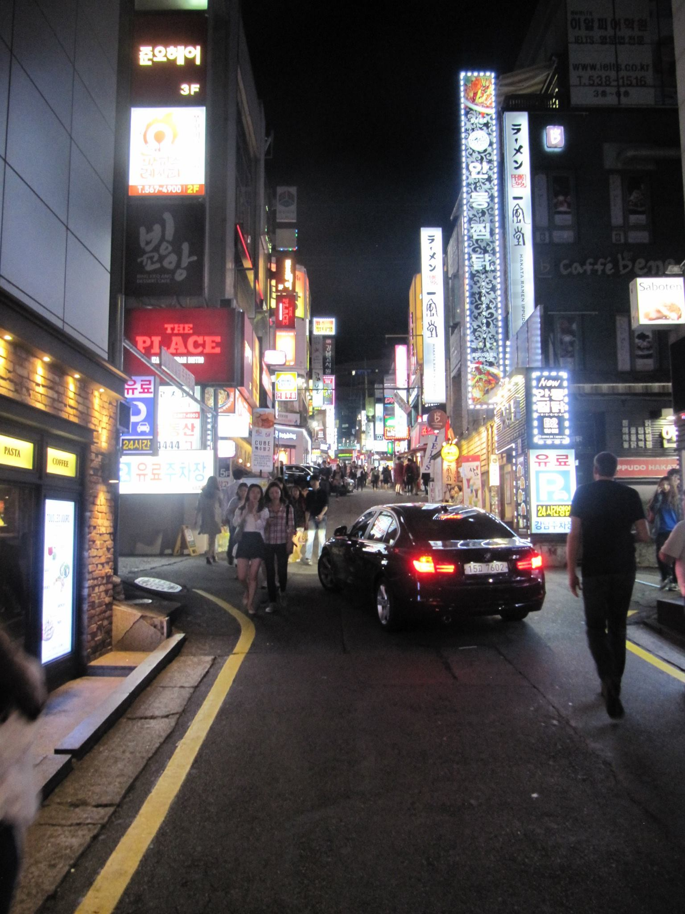
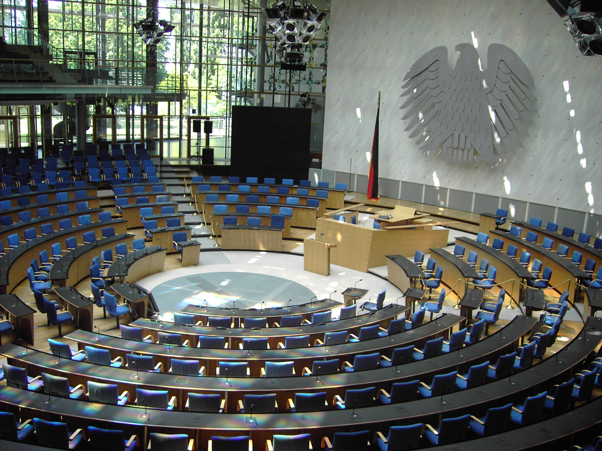

title: Meninger, ferske fra Seoul
author:
  name: Robert Nordan
  twitter: robpvn
  url: https://github.com/Norkart
theme: Norkart/cleaver-theme
--
#Meninger, ferske fra Seoul

--
#Beliggenhet betyr noe, ikke bare metaforisk

--
#The Year of Javascript & The Old School Strikes Back

--
#Projeksjoner er kult igjen

--
#Er OpenStreetMap ikke åpent nok?

--
#Punktskyer er på moten

--
#OpenDroneMap eier

--
#OpenAerialMap er som OSM for orto

--
#Cesium har modnet

--
#GeoPackage: Den nye OGC-standarden du bør bry deg om

--
#SensorThings: Den enda nyere OGC-standarden du også bør bry deg om

--
#WPS: Den ikke fullt så nye OGC-standarden folk har begynt å bry seg om

--
#Maskinlæring: Ikke en OGC-standard, men noe du bør bry deg om

--
#FOSS4G 2016: Blir neppe Bonn i bøtta!

"Bonn Bundestag Plenarsaal1" by Qualle. Licensed under CC BY-SA 3.0 via Wikimedia Commons
